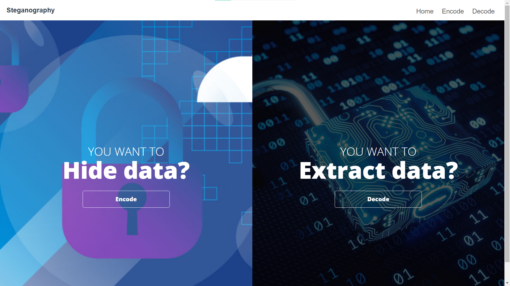
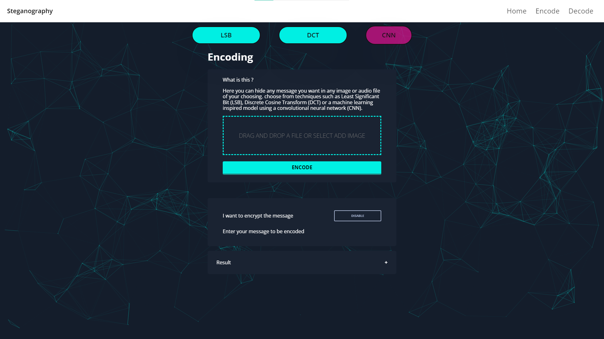
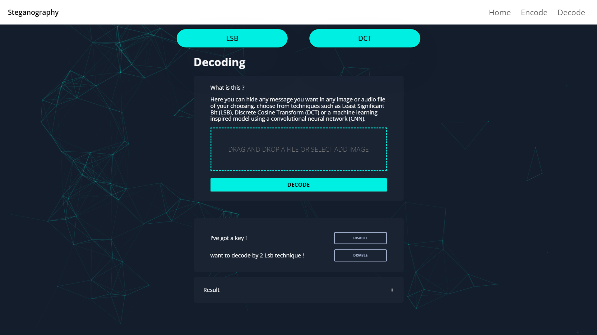
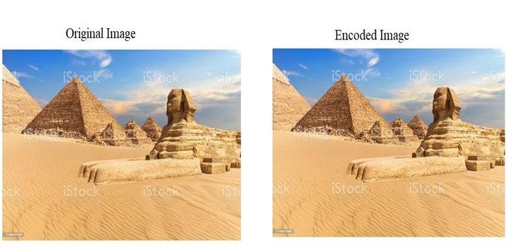

# Steganography Project

## Overview
This project is a steganography web application that includes various features such as image processing, audio decoding, and more. The backend is powered by Django and Cassandra. This project won 3rd place across all of Egypt's graduation projects in Nile University's 14th Undergraduate Research Forum special edition.

## Project Structure
- `backend/`: Contains files to activate Cassandra and Django.
- `src/`
  - `js/`: JavaScript source files.
  - `html/`: HTML files.
- `styles/`: CSS stylesheets.
- `assets/`
  - `images/`: Image files.
  - `audio/`: Audio files.
- `particles.js-master/`: Third-party library for particle effects.
- `README.md`: Project overview and instructions.
- `LICENSE`: Project license (if applicable).

## Project Methods

The first part of the project involved implementing conventional steganographic techniques that use spatial or frequency domain components to hide data. The spatial domain techniques implemented were Least Significant Bit (LSB), 2-LSB, and audio LSB. The frequency domain technique implemented was based on Discrete Cosine Transform (DCT) components.

The second part of the project involved studying machine learning based steganographic techniques. A recent technique based on Convolution Neural Networks (CNN) was implemented both as an encoder and as a decoder.

To test the efficiency of all the hiding techniques, Peak Signal to Noise Ratio (PSNR) and Least Mean Square Errors were calculated to compare the original carrier image and the stego image.

Finally, to increase the security, the capability of encrypting the message before inserting it in the carrier and decrypting back after extracting it was added.

## Screenshots
Here are some screenshots of the project:

### Home Page

### Encoding Page

### Decoding Page

### Example of LSB Encoding

### Example of CNN Encoding

